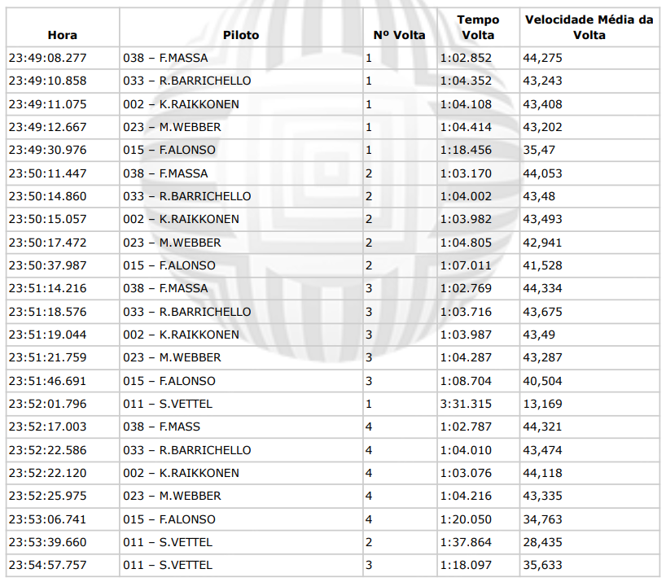

# **Grupo CRIAR - Teste de Lógica**

## VISÃO GERAL

O desafio consiste em processar um arquivo de log de uma corrida de kart e gerar informações estatísticas sobre o desempenho dos pilotos.

## REGISTRO DOS DADOS



O arquivo `data/log_kart.csv` contém os registros da corrida , utilizando `;` como delimitador.

##########################################################################################################

A partir do log acima, devem ser obtidas as seguintes informações:

1. **Tabela de resultados da corrida**, contendo:
   - Posição de chegada
   - Código do piloto
   - Nome do piloto
   - Quantidade de voltas completadas
   - Tempo total de prova

    #*A corrida termina quando o **primeiro colocado completa 4 voltas**.*

2. **Melhor volta de cada piloto**
3. **Melhor volta da corrida**
4. **Velocidade média de cada piloto** durante toda a corrida
5. **Diferença de tempo** de cada piloto em relação ao vencedor


## 📦 Como executar

```
# Clonar o projeto
git clone https://github.com/robitooS/kart-race-criar# Instalar dependências

# Baixar depêndencias
pip install -r requirements.txt

# Executar script principal
python scripts/resultados_corrida_kart.py
```
